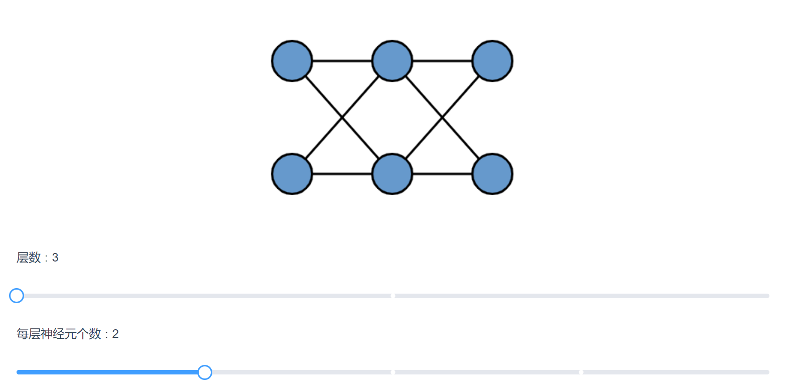
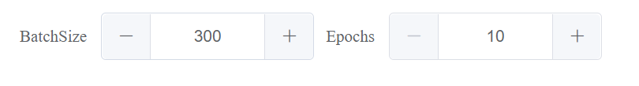
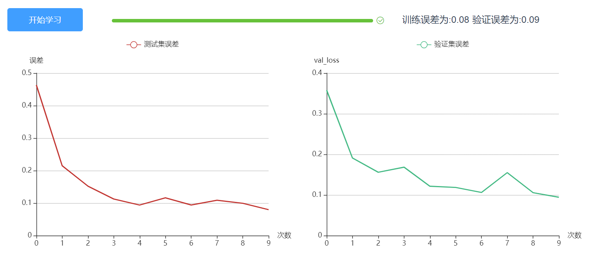

# 前端机器学习———光伏功率预测系统

## 基本介绍
基于浏览器制作一个简单的AI,用户只需通过简单的鼠标点击来预测一段时间后的光伏发电功率，从而为电网负载均衡提供帮助。

## 在线浏览地址
http://47.254.216.86:8080/#/

## 技术栈
* 机器学习库 : TensorflowJS
* 框架: vue
* 图表: echart
* 界面: elementUI

## 演示
**通过滑块定制自己神经网络结构**
(可以估计简化模型或者加深模型复杂度，来观察过拟合与欠拟合现象)

**超参量选择**

**模型学习过程中，MSE误差下降曲线**

**实时显示模型在验证数据前200个点的表现**

**在测试数据中的表现(未来数据)**

**用户输入预测日的具体信息，比如天气数据与时间数据。后台完成数据归一化操作，并进行预测返回预测信息。**

**每隔一段时间更新实际数据与预测数据**

